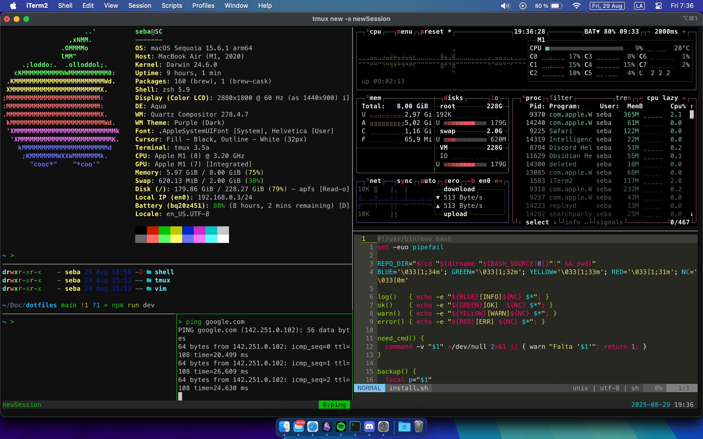

# 🛠️ Dotfiles

[](./LICENSE)


Colección personal de **dotfiles** y configuraciones para entornos de desarrollo en **Linux (Arch)** y **macOS**.
Incluye configuraciones de **Zsh**, **Git**, **Tmux**, **Vim** y scripts de instalación para automatizar el setup de un nuevo sistema.

---

## ✨ Features

- ⚡ Configuración de **Zsh**
  - Alias y funciones personalizados
  - Integración con **Oh My Zsh** (plugin `git`)
- 📂 Configuración global de **Git** (`.gitconfig`, `.gitignore_global`)
- 🔧 Configuración de **Tmux**
  - Prefijo en `Ctrl+a`
  - Movimientos tipo Vim en panes
  - Copiar al portapapeles en macOS (`pbcopy`) o Linux (`xclip`)
  - Plugins vía **TPM** (`tmux-sensible`, `tmux-resurrect`, `tmux-continuum`)
- ✍️ Configuración de **Vim**
  - Modular (`.vimrc` + `my_configs.vim`)
  - Preparado para **vim-plug**
- 📦 Instalación de paquetes:
  - Arch Linux → `packages.arch` + `aur-packages.arch`
  - macOS → `Brewfile.mac`
- 🔗 Symlinks automáticos con **GNU Stow**

---

## 📋 Requisitos

- **Git**
- **Zsh** como shell principal
- **Oh My Zsh** (para el plugin `git` en `.zshrc`)
  ```bash
  sh -c "$(curl -fsSL https://raw.githubusercontent.com/ohmyzsh/ohmyzsh/master/tools/install.sh)"
  ```
- **GNU Stow** (el script lo instala si no está presente)
- Acceso a un sistema:
  - Arch Linux (con `pacman` y opcionalmente `yay`)
  - macOS (con `brew`)

---

## 🚀 Instalación

Puedes clonar el repositorio en la carpeta que prefieras (ej. `~/Documentos/`) y ejecutar el script de instalación:

```bash
git clone https://github.com/sebacruz1/dotfiles.git ~/Documentos/dotfiles
cd ~/Documentos/dotfiles
./install.sh
```

El script detecta tu sistema operativo, instala dependencias y enlaza los dotfiles en tu `$HOME` usando **GNU Stow**.

### Arch Linux

```bash
sudo pacman -Syu --noconfirm
sudo pacman -S --needed - < packages.arch
yay -S --needed - < aur-packages.arch
```

### macOS

```bash
brew bundle --file=Brewfile.mac
```

---

## ⚠️ Advertencia

- Al ejecutar `install.sh`, si ya tienes archivos de configuración (ej: `~/.zshrc`, `~/.vimrc`, `~/.gitconfig`, etc.), estos serán **reemplazados por symlinks** que apuntan a los dotfiles de este repositorio.
- **No se pierden tus configuraciones anteriores**: antes de reemplazarlos, el script hace un backup en `~/.dotfiles_backup/`.
- Si quieres restaurar tu configuración previa, puedes copiar los archivos desde esa carpeta.

---

## 🔑 Configuración de Git

El archivo [`.gitconfig`](./git/.gitconfig) incluido en este repo contiene opciones globales útiles, pero deberás configurar tus credenciales personales:

```bash
git config --global user.name "Tu Nombre"
git config --global user.email "tu-email@example.com"```
## ⚙️  Qué hace el script

1. Detecta el sistema operativo (macOS / Arch Linux / otro Linux).
2. Instala dependencias con `brew`, `pacman` o `yay`.
3. Aplica **symlinks** de los dotfiles con GNU Stow.
4. Configura **Git** con `~/.gitignore_global`.
5. Instala **TPM (Tmux Plugin Manager)**.
6. Da tips finales para activar plugins en Tmux y Vim.
 ```

---

## 📂 Estructura

```
dotfiles/
├── git/              # Configuración de Git
├── shell/            # Configuración de Zsh (alias, funciones, zshrc, zprofile)
├── tmux/             # Configuración de Tmux
├── vim/              # Configuración de Vim
├── packages.arch     # Paquetes oficiales (pacman)
├── aur-packages.arch # Paquetes AUR (yay)
├── Brewfile.mac      # Paquetes para macOS (Homebrew)
└── install.sh        # Script de instalación
```

---

## 📸 Screenshots


---

## 📜 Licencia

Este proyecto está bajo la licencia [MIT](./LICENSE).
