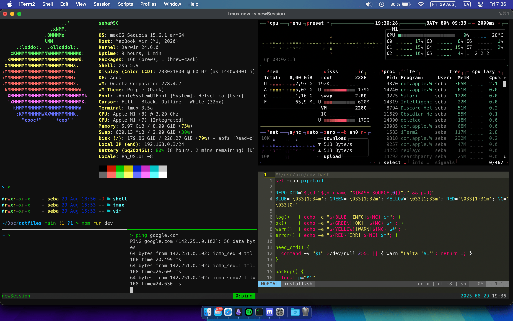

# Dotfiles

[](./LICENSE)


Colección personal de **dotfiles** y configuraciones para entornos de desarrollo en **macOS**.
Incluye configuraciones de **Zsh**, **Git**, **Kitty**, **Tmux**, **Starship**, **Neovim** y scripts de instalación para automatizar el setup de un nuevo sistema.

---

## Features

- Configuración de **Zsh**
  - Alias y funciones personalizados
  - Gestor de plugins con **Antidote**
  - Integración con plugins seleccionados (git, composer, laravel, npm, docker)
  - FZF, fast-syntax-highlighting, fzf-tab
- Configuración de **Starship**
- Configuración de **Kitty**
- Configuración global de **Git** (`.gitconfig`, `.gitignore_global`)
- Configuración de **Tmux**
  - Prefijo en `Ctrl+a`
  - Movimientos tipo Vim en panes
  - Copiar al portapapeles en macOS (`pbcopy`)
  - Plugins vía **TPM** (`tmux-sensible`, `tmux-resurrect`, `tmux-continuum`)
- Configuración de **Neovim**
  - Modular (configuración en `~/.config/nvim`)
  - Uso de Lazy
- Instalación de paquetes:
  - macOS → `Brewfile.mac`
- Symlinks automáticos con **GNU Stow**

---

## Requisitos

- **Git**
- **Zsh** como shell principal
- Los siguientes se instalan automáticamente con `Brewfile.mac`:
  - **Antidote** (gestor de plugins para Zsh)
  - **Starship** (prompt moderno)
  - **Kitty** (emulador de terminal)
  - **Neovim**
  - **Tmux**
  - Otros tools (fzf, fd, delta, zoxide, etc.)

---

## Instalación

Puedes clonar el repositorio en la carpeta que prefieras (ej. `~/Documentos/`) y ejecutar el script de instalación:

```bash
git clone https://github.com/sebacruz1/dotfiles.git ~/Documentos/dotfiles
cd ~/Documentos/dotfiles
./install.sh
```

---

## Limpieza previa (opcional)

Si al correr `./install.sh` ves errores de **Stow** como:

```bash
WARNING! stowing shell would cause conflicts:
 * cannot stow .../.zprofile over existing target .zprofile
 * cannot stow .../.zshrc over existing target .zshrc
All operations aborted.
```

significa que ya tienes dotfiles en tu `$HOME` que entran en conflicto.
Para resolverlo fácilmente, este repo incluye un script de limpieza:

```bash
./cleanup.sh
./install.sh
```

## Advertencia

- Al ejecutar `install.sh`, si ya tienes archivos de configuración (ej: `~/.zshrc`, `~/.config/nvim/init.vim`, `~/.gitconfig`, etc.), estos serán **reemplazados por symlinks** que apuntan a los dotfiles de este repositorio.
- **No se pierden tus configuraciones anteriores**: antes de reemplazarlos, el script hace un backup en `~/.dotfiles_backup/`.
- Si quieres restaurar tu configuración previa, puedes copiar los archivos desde esa carpeta.

---

## Configuración de Git

El archivo [`.gitconfig`](./git/.gitconfig) incluido en este repo contiene solo configuración global compartible.
Las credenciales personales ahora van en `~/.gitconfig.local` (archivo local y **no versionado**).

```bash
nvim ~/.gitconfig.local
```

Contenido recomendado:

```ini
[user]
    name = Tu Nombre
    email = tu-email@example.com
```

## Qué hace el script

1. Detecta el sistema operativo.
2. Instala dependencias con `brew`.
3. Aplica **symlinks** de los dotfiles con GNU Stow.
4. Configura **Git** con `~/.gitignore_global`.
5. Instala **TPM (Tmux Plugin Manager)**.

---

## Estructura

```
dotfiles/
├── git/              # Configuración de Git
├── shell/            # Configuración de Zsh
├── starship/         # Configuración de Starship
├── kitty/            # Configuración de Kitty
├── tmux/             # Configuración de Tmux
├── nvim/             # Configuración de Neovim
├── Brewfile.mac      # Paquetes para macOS
├── install.sh        # Script de instalación
└── cleanup.sh        # Script de limpieza
```

---

## Screenshots

## 

## Licencia

Este proyecto está bajo la licencia [MIT](./LICENSE).
